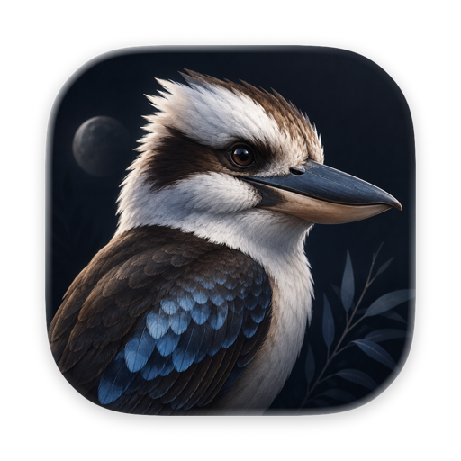

<p align="center">
  
</p>

<h1 align="center">Kookaburra Cut</h1>

<p align="center">A local, <strong>deterministic</strong> animated-video studio for macOS (Apple Silicon).</p>

Kookaburra Cut renders every visual (animated text, graphics, and 3D) through a single
react-three-fiber WebGL canvas, and exports video by stepping a manual clock
frame-by-frame into a bundled **ffmpeg** sidecar (H.264 / H.265 / ProRes). It runs in
pure WKWebView via Tauri 2, no Chromium. Two exports of the same project are
byte-identical by design.

<p align="center">
  <a href="https://kookaburracut.com/">
    
  </a>
</p>

<p align="center"><sub>Reworking a device scene from the embedded agent terminal. More at <a href="https://kookaburracut.com/">kookaburracut.com</a>.</sub></p>

> Status: in active development, pre-release. Everything runs locally: no
> telemetry, no cloud, no accounts. Two opt-in network exceptions: the optional
> embedded Claude Code terminal, which only ever runs when you explicitly
> invoke it (it installs via a script shown in the terminal and talks to
> Anthropic while you use it), and the update check, off until you enable it,
> which asks GitHub whether a newer release exists and sends no identifiers.

## What it does

- **Projects and scenes**: a project is a folder (`project.json` + `scenes/*.tsx` +
  assets); scenes are React components built from the `@kookaburra/toolkit`
  primitives (animated text, counters, image cards, video clips, 3D devices,
  staging).
- **Themes**: JSON documents covering colour, typography, lighting, staging and
  text-motion defaults; swappable per project or per scene.
- **Devices & media**: video and images play on a 3D handset's screen through a
  deterministic frame-extraction pipeline; per-scene camera moves ride orbit
  keyframes.
- **Transitions & sound**: a transition pack with a live-preview picker, and one
  soundtrack per project with a sample-exact mux.
- **Export presets**: platform presets (social, CTV, web, ProRes master) with
  size estimates and loudness targeting, alongside the frozen deterministic
  default path.
- **Embedded agent terminal**: a built-in Claude Code session scoped to the open
  project, for authoring scenes conversationally.

## Stack

Tauri 2 · React 19 · react-three-fiber · troika SDF text · anime.js v4 · zustand ·
ffmpeg/ffprobe sidecars. Package manager: **pnpm**. Full version list in
[`docs/architecture.md`](docs/architecture.md).

## Prerequisites

- macOS on Apple Silicon, Xcode command-line tools
- Node ≥ 20.19, pnpm
- Rust stable (`rustup default stable`)
- ffmpeg on `PATH` (for the dev sidecar copy)

## Quick start

```bash
pnpm install
pnpm setup:ffmpeg     # provision the ffmpeg sidecar (dev copy of system ffmpeg)
pnpm tauri dev        # launch the app (Vite HMR + WKWebView shell)
```

Other commands:

```bash
pnpm build            # tsc --noEmit + vite build
pnpm test             # vitest
pnpm lint             # biome check .
```

> Note: the photoreal device model is a licensed third-party asset and is
> **not** included in this repository (see Licensing below). Clones build and
> run against a bundled generic placeholder handset; dropping a licensed model
> into `src/assets/models/licensed/` overrides it (see
> `src/assets/models/README.md`).

### Refreshing the app icon / identity in dev

Tauri's build script embeds the icon set and the `Info.plist` (app name) into the dev
binary at **compile time** and does not re-run when `src-tauri/icons/` changes, so
`pnpm tauri dev` keeps showing the old icon/name until the shell recompiles.

```bash
pnpm setup:icon       # regenerate icons from the Icon Composer master; cleans the shell too
pnpm clean:shell      # clean manually (e.g. after identity edits in tauri.conf.json)
pnpm tauri dev        # first launch recompiles and re-embeds
```

If the Dock still shows the old icon after that, it's macOS's own icon cache:
`killall Dock`. The icon master is the Icon Composer 1024px export, used verbatim:
never re-mask it (see `scripts/make-icons.sh`).

## Layout

```
src/toolkit/   shipped authoring primitives  (the @kookaburra/toolkit surface)
src/engine/    timeline · format · compositor · exporter (deterministic loop)
src/theme/     theme schema, bundled themes, fonts
src/store/     zustand editor/preview state
projects/      one folder per project: project.json + scenes/ + assets/
src-tauri/     Rust shell, tauri.conf.json, capabilities/, bin/ (sidecars)
docs/          architecture, determinism, decisions, design, voice
.claude/       project skills (scene authoring, export presets) + slash commands
```

## Authoring scenes

Scenes live in `projects/<project>/scenes/*.tsx` as `defineScene` default exports and
use `@kookaburra/toolkit` only: never the DOM or the wall clock. See the
`kookaburra-scene-authoring` skill and `/new-scene`, or
[`docs/determinism.md`](docs/determinism.md) for the why.

## Documentation

Start at [`docs/README.md`](docs/README.md). The short version:
[`docs/architecture.md`](docs/architecture.md) explains how rendering and export
work, [`docs/determinism.md`](docs/determinism.md) is the byte-identical-export
contract, and [`docs/decisions.md`](docs/decisions.md) records every locked
decision and why.

## Contributing & security

This is a personal, source-available project. Issues and discussion are welcome;
pull requests may be declined: see [`CONTRIBUTING.md`](CONTRIBUTING.md).
Security reports: see [`SECURITY.md`](SECURITY.md).

## Licensing

Kookaburra Cut's code is dual-licensed under either the
[MIT License](LICENSE-MIT) or the [Apache License 2.0](LICENSE-APACHE), at
your option. Bundled assets keep their own terms: fonts are OFL 1.1, HDRI
environments are CC0 (Poly Haven), and the photoreal device model is a
purchased licensed asset that is deliberately **not** in the repo (its
committed preview images are not reusable outside this project). The ffmpeg
sidecar the app drives is a **GPL** build (libx264/libx265), provisioned
locally by script and never committed here. Full inventory:
[NOTICE.md](NOTICE.md).

## Trademarks & affiliation

Kookaburra Cut is an independent project. Apple and iPhone are trademarks of
Apple Inc.; device names in the catalogue identify the hardware being
depicted. Platform names in export presets (Meta, TikTok, YouTube, LinkedIn,
X, Reddit, Telegram) identify export targets only. This project is not
affiliated with, sponsored by, or endorsed by Apple, OpenAI, Anthropic, or
any of those platforms.
